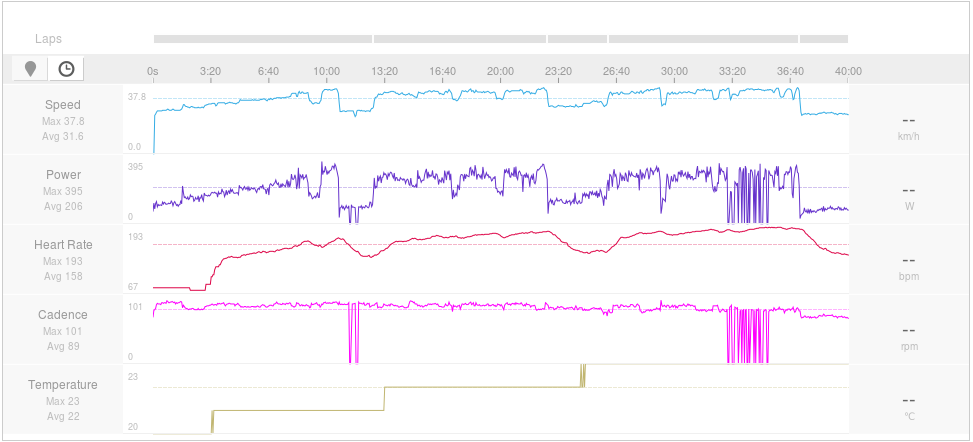
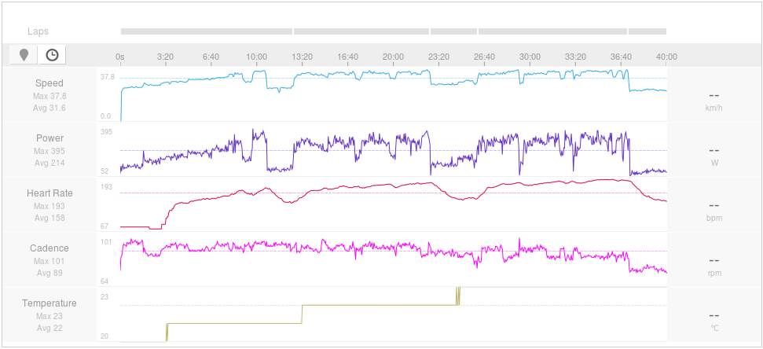

# FitFix
When using [cycling power meters](https://en.wikipedia.org/wiki/Cycling_power_meter) in indoor trainers, sometimes power data drops
and isn't recorded. FitFix recovers the lost data using speed at the loss moment and statistics before that moment.

## Installation
* Obtain Fit SDK from https://www.thisisant.com/resources/fit.
* Copy FitCSVTool.jar to FitFix's directory: ```cp fitsdk/java/FitCSVTool.jar .```

## Usage
Run:

     ./fitfix.sh input_file.fit output_file.fit

## Example

An example of a corrputed file uploaded to [Strava](https://strava.com/):



Recovered using FitFix:



